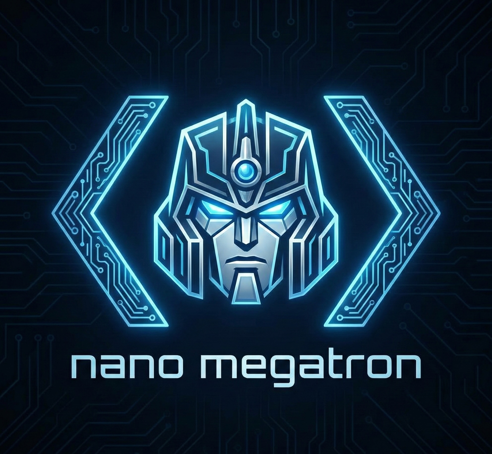

<p align="center">

</p>

<div align="center">

# Nano-Megatron

**A Lightweight, Educational, yet Powerful Megatron-LM Implementation**

[](LICENSE)
[](https://github.com/Odysseusq/nano-megatron)
[](http://makeapullrequest.com)

[Features](#-key-features) • [Installation](#-installation) • [Quick Start](#-quick-start) • [Configuration](#%EF%B8%8F-configuration) • [Roadmap](#-roadmap)

</div>

---

## 📖 Introduction

**Nano-Megatron** is a minimalist implementation of the Megatron-LM architecture, designed to be **readable**, **hackable**, and **efficient**. With only ~1,200 lines of core code, it strips away the complexity while retaining the essential performance features needed for training Large Language Models (LLMs).

Whether you are a researcher wanting to understand the internals of Tensor Parallelism or an engineer looking for a lightweight training codebase, Nano-Megatron is built for you.

## 🚀 Key Features

| Feature | Description |
| :--- | :--- |
| **🏎️ High Performance** | Comparable training speeds to the original Megatron-LM. |
| **🛠️ Readable Code** | Clean, typed, and well-structured codebase (~1.2k LOC). |
| **🧩 Tensor Parallelism** | Efficient TP implementation for scaling across GPUs. |
| **🧠 Super Efficient** | Supports FP32 Gradient Accumulation, Checkpointing, and Data Packing. |
| **🤗 HF Native** | Directly train HF models without conversion (MBridge). |

## 📦 Installation

You can install Nano-Megatron from the source:

```bash
git clone https://github.com/Odysseusq/nano-megatron.git
cd nano-megatron
pip install -e .
```

## 🏁 Quick Start

Train your first model in just 4 steps.

### 1. Prepare Model Weights
Download a base model (e.g., Qwen) to start with:

```bash
hf download Qwen/Qwen3-0.6B
```

### 2. Prepare Dataset
Prepare a simple `jsonl` dataset. Keys should be `text`.

```bash
# Use wikitext to create a jsonl-formatted dataset
python -c "from datasets import load_dataset; load_dataset('wikitext', 'wikitext-2-raw-v1', split='train').to_json('data.jsonl')"
```

### 3. Configure Training
Modify `config.yaml` to match your setup.

```yaml
model:
  path: Qwen/Qwen3-0.6B  # Path to your model

data:
  path: data.jsonl  # Path to your dataset
  micro_batch_size: 2
  seq_len: 2048
  gradient_accumulation_steps: 2

parallelism:
  tp: 2  # Set Tensor Parallelism degree
```

### 4. Start Training 🚀
Launch the training script:

```bash
python train.py
```

## ⚙️ Configuration

Control every aspect of training via `config.yaml`.

| Section | Key Settings |
| :--- | :--- |
| **Model** | Path, Data Type |
| **Data** | Path, Micro Batch Size, Gradient Accumulation Steps |
| **Optimizer** | LR, Weight Decay, Warmup, Beta Params |
| **Parallelism** | Tensor Parallelism (TP) Size, Port |
| **Checkpoint** | Save Directory, Save Interval |

## 🗺️ Roadmap

We are actively working on:

- [ ] 🔄 **Data Parallelism (DP)**
- [ ] 🚀 **ZeRO Optimizer Support**
- [ ] 📉 **Validation Loss Monitoring**
- [ ] 📊 **Wandb Integration**
- [ ] 🧪 **Comprehensive Benchmarks**

## 🤝 Contributing

Contributions are welcome! If you find a bug or want to add a feature, please feel free to open an issue or submit a Pull Request.

## 📜 License

This project is licensed under the [MIT License](LICENSE).

## 🌟 Star History

[](https://www.star-history.com/#Odysseusq/nano-megatron&Date)
